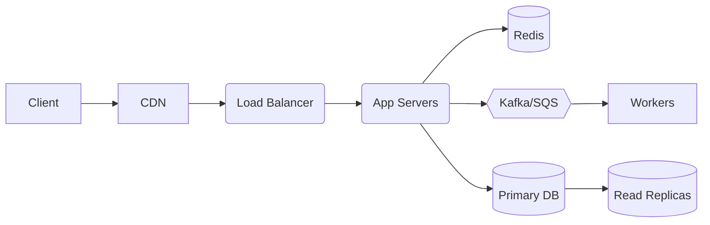
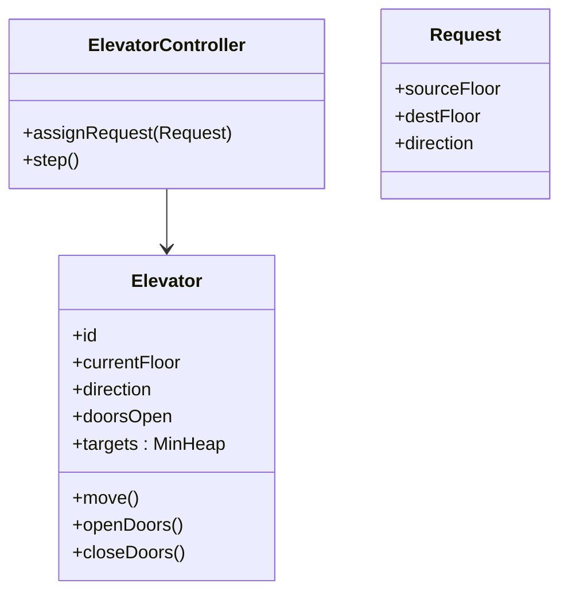
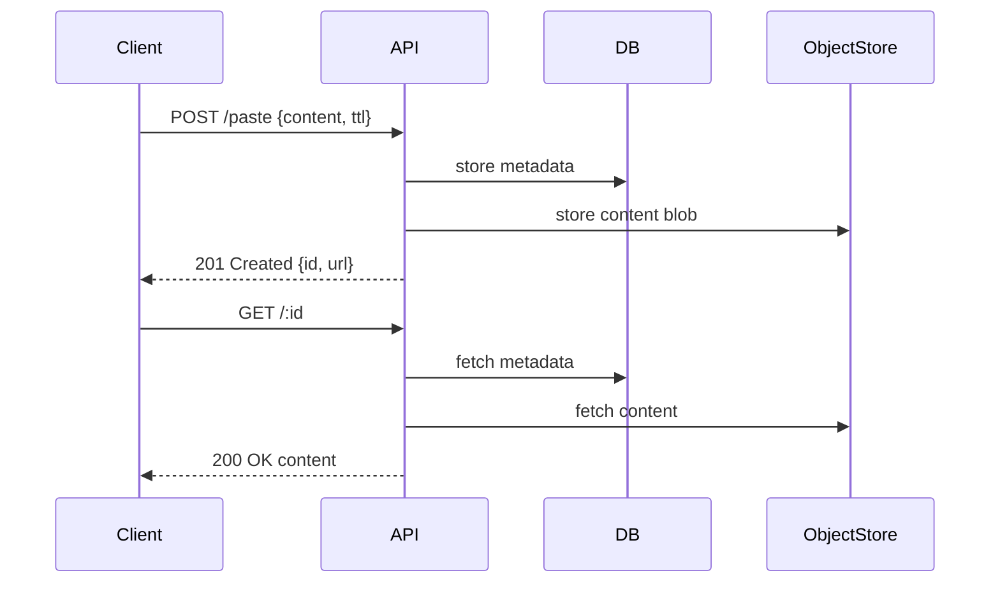

# Full-Stack JavaScript Interview Preparation Guide
*A complete, production-quality README for JavaScript, React, Node.js, Databases, System Design & DSA.*

# Documentation Index
- [Javascript Coding Docs](/javascriptCoding.md)
- [Javascript QA Docs](/JS_Interview_QA_README.md)
- [CSS Interview Question](/CSS_Interview_Questions_README.md)
- [Reactjs InterviewQuestion Docs](/reactjs_interview_questions.md)
- [Redux Interview questions Docs](/redux_interview_questions.md)
- [Nodejs Interview questions Docs](/nodejs_interview_questions.md)
- [Complete MERN STACK Guide Docs](/MERN_Stack_Interview_Guide.md)
- [PostgressSQl interview question](/PostgreSQL_Interview_Questions.md)

---

## 📚 Table of Contents
1. [JavaScript & ReactJS (Front-End)](#javascript--reactjs-front-end)
2. [NodeJS & Backend Development](#nodejs--backend-development)
3. [Databases & System Design](#databases--system-design)
4. [Data Structures & Algorithms (DSA)](#data-structures--algorithms-dsa)
5. [React Developer LLD Challenges](#react-developer-lld-challenges)
6. [Basic & Frequently Asked JavaScript Questions](#basic--frequently-asked-javascript-questions)
7. [How to Practice](#how-to-practice)
8. [License](#license)

---

## JavaScript & ReactJS (Front-End)

### 1) Difference between `var`, `let`, and `const`
| Feature | `var` | `let` | `const` |
|---|---|---|---|
| Scope | Function-scoped | Block-scoped | Block-scoped |
| Hoisting | Yes (initialized to `undefined`) | Yes (in TDZ) | Yes (in TDZ) |
| Re-declare | ✅ | ❌ | ❌ |
| Re-assign | ✅ | ✅ | ❌ (but object contents can mutate) |

```js
function demo() {
  if (true) {
    var a = 1;    // function-scoped
    let b = 2;    // block-scoped
    const c = 3;  // block-scoped
  }
  console.log(a); // 1
  // console.log(b); // ReferenceError (TDZ/block)
  // console.log(c); // ReferenceError
}
demo();
```

---

### 2) How does the JavaScript event loop work?
- **Call Stack** runs synchronous code.
- **Web APIs** host async operations (timers, fetch, DOM events).
- **Queues**: 
  - **Microtask queue** (Promises, `queueMicrotask`, `process.nextTick`) — runs **before** macrotasks.
  - **Macrotask queue** (setTimeout, setInterval, setImmediate, I/O).
- **Event Loop** moves tasks to stack when it’s empty.

```js
console.log("Start");
setTimeout(() => console.log("Timeout"), 0);
Promise.resolve().then(() => console.log("Promise"));
console.log("End");
// Output: Start → End → Promise → Timeout
```

---

### 3) Explain closures with an example
A closure is when an inner function *remembers* variables of its outer function **even after** the outer function has returned.

```js
function counter(start = 0) {
  let count = start;
  return {
    inc: () => ++count,
    dec: () => --count,
    get: () => count
  };
}

const c = counter(10);
c.inc(); // 11
c.inc(); // 12
console.log(c.get()); // 12
```

**Use cases:** data privacy, function factories, caching/memoization, event handlers.

---

### 4) Promises vs `async/await`
- **Promise**: an object representing a future value (`pending` → `fulfilled`/`rejected`).
- **async/await**: syntactic sugar for Promises; reads like synchronous code, still non-blocking.

```js
// Promise chaining
fetch("/api/users")
  .then(res => res.json())
  .then(data => console.log(data))
  .catch(err => console.error(err));

// async/await
async function loadUsers() {
  try {
    const res = await fetch("/api/users");
    const data = await res.json();
    console.log(data);
  } catch (e) {
    console.error(e);
  }
}
```

---

### 5) Shallow vs Deep Copy
- **Shallow**: copies top-level fields, nested objects share references.
- **Deep**: duplicates the entire object graph.

```js
const a = { nested: { x: 1 }, arr: [1,2] };
const shallow = { ...a };            // shallow
const deep = structuredClone(a);     // deep (Node 17+/modern browsers)

a.nested.x = 99;
console.log(shallow.nested.x); // 99 (shared ref)
console.log(deep.nested.x);    // 1  (independent)
```

**Alternatives**: `JSON.parse(JSON.stringify(obj))` (loses Dates/Map/Set/undefined), libraries like `lodash.cloneDeep`.

---

### 6) `==` vs `===`
- `==` performs **type coercion** (error-prone in edge cases).
- `===` is **strict equality** (type + value). Prefer `===`.

```js
0 == "0";  // true
0 === "0"; // false
null == undefined;  // true
null === undefined; // false
```

---

### 7) What is the Virtual DOM and how does React use it?
- **Virtual DOM (VDOM)**: an in-memory tree of lightweight objects describing the UI.
- On state updates, React builds a new VDOM, **diffs** it with the previous one (reconciliation), and **patches** the real DOM with minimal changes.
- Benefits: performance, declarative UI, predictable updates.

---

### 8) Purpose of React Hooks. How does `useEffect` work?
- Hooks enable stateful logic in function components.
- **`useEffect`** runs after render; use it for side effects (data fetching, subscriptions, DOM interactions).

```jsx
import { useEffect, useState } from "react";

function Users() {
  const [users, setUsers] = useState([]);

  useEffect(() => {
    let cancelled = false;
    (async () => {
      const res = await fetch("/api/users");
      const data = await res.json();
      if (!cancelled) setUsers(data);
    })();
    return () => { cancelled = true; }; // cleanup
  }, []); // deps: run once on mount

  return <pre>{JSON.stringify(users, null, 2)}</pre>;
}
```

**Rules of Hooks**: call at top level; only in React functions; dependencies must include all external values you use.

---

### 9) Controlled vs Uncontrolled Components
- **Controlled**: value comes from React state (`value` + `onChange`).
- **Uncontrolled**: DOM holds state; read via `ref`.

```jsx
// Controlled
<input value={name} onChange={e => setName(e.target.value)} />

// Uncontrolled
<input ref={inputRef} defaultValue="John" />
```

Use controlled for validation and predictable state; uncontrolled for simple forms or performance-critical inputs.

---

### 10) Significance of `key` props in React lists
- `key` gives each element a **stable identity** across renders to help reconciliation.
- Must be **unique** within the list and **stable** — avoid using array indices if items can reorder.

```jsx
{todos.map(todo => (
  <TodoItem key={todo.id} {...todo} />
))}
```

---

## NodeJS & Backend Development

### 1) What is event-driven architecture in NodeJS?
- Node’s core is an **event loop**; I/O is non-blocking and signals completion via **events**.
- You subscribe with **callbacks**/listeners; system scales with many concurrent I/O operations.

```js
const EventEmitter = require("events");
const bus = new EventEmitter();

bus.on("user:created", (u) => console.log("Welcome", u.name));
bus.emit("user:created", { name: "Ada" });
```

---

### 2) How does NodeJS handle asynchronous operations?
- Non-blocking I/O APIs (libuv).
- Patterns: **callbacks**, **Promises**, **async/await**, **streams**, **workers** (CPU-bound).

```js
const fs = require("fs/promises");
async function readFileSafe(path) {
  try { return await fs.readFile(path, "utf8"); }
  catch (e) { console.error(e); return null; }
}
```

---

### 3) What are middleware functions in ExpressJS?
Middleware are functions with signature `(req, res, next)` that run **before/around** route handlers.

```js
const express = require("express");
const app = express();

app.use(express.json()); // parse JSON body

app.use((req, _res, next) => { // logger
  console.time(req.method + " " + req.url);
  next();
  console.timeEnd(req.method + " " + req.url);
});

app.get("/health", (_req, res) => res.send("ok"));

app.listen(3000);
```

---

### 4) Authentication in NodeJS — JWT vs OAuth
- **JWT**: stateless, self-contained token (header.payload.signature). Good for first-party APIs.
  - Pros: no server session store; easy horizontal scaling.
  - Cons: token revocation is tricky; keep expiry short & rotate.
- **OAuth 2.0**: authorization **framework** for delegated access (Google/GitHub login, API access). Often with **OpenID Connect** for identity.

```txt
JWT Flow: Client logs in → server issues JWT → client sends JWT in Authorization header → server verifies signature on each request.
OAuth Flow: Client redirects to provider → user consents → provider issues tokens → client uses access token for resource server.
```

---

### 5) What are WebSockets, and when to use them?
- A **persistent, bidirectional** channel over a single TCP connection.
- Use for realtime features: chat, live dashboards, games, collaborative editing.

```js
// server (ws)
const WebSocket = require("ws");
const wss = new WebSocket.Server({ port: 8080 });
wss.on("connection", ws => ws.on("message", m => ws.send("echo: " + m)));
```

---

### 6) Monolithic vs Microservices architectures
| Aspect | Monolith | Microservices |
|---|---|---|
| Deploy | Single unit | Many small services |
| Scaling | Whole app | Per service |
| Complexity | Lower | Higher (network, ops, CI/CD) |
| Data | Single DB | Polyglot persistence |
| Best for | Small/medium teams, simple domains | Large orgs, complex/independent domains |

Start monolith → extract services when needed (clear bounded contexts, independent scaling, team ownership).

---

### 7) How does NodeJS handle memory management?
- Uses **V8** heap with **generational GC** (young/old space) and **mark-and-sweep**.
- Avoid memory leaks: unbounded caches, event listeners not removed, large closures, global references.
- For CPU-bound tasks: use **Worker Threads** or offload to services.

```js
// Detect growth
setInterval(() => {
  const { heapUsed, heapTotal, rss } = process.memoryUsage();
  console.log({ heapUsed, heapTotal, rss });
}, 5000);
```

---

## Databases & System Design

### 1) SQL vs NoSQL databases
| | SQL (Relational) | NoSQL (Document/Key-Value/Column/Graph) |
|---|---|---|
| Schema | Rigid | Flexible |
| Queries | SQL joins | API-specific, denormalized |
| Consistency | Strong (typically) | Tunable (often eventual) |
| Use cases | Complex relationships, transactions | High-scale reads, flexible docs, analytics |

Examples: **PostgreSQL/MySQL** vs **MongoDB/DynamoDB/Redis/Cassandra/Neo4j**.

---

### 2) How does indexing work?
- Index is a data structure (often **B-Tree** or **hash**) that speeds up lookups by avoiding full scans.
- Trade-offs: additional storage, slower writes, careful choice of indexed columns & order.

```sql
-- Composite index example
CREATE INDEX idx_user_email_status ON users (email, status);
```

---

### 3) What are ACID properties?
- **Atomicity**: all or nothing.
- **Consistency**: constraints preserved.
- **Isolation**: concurrent txns don’t interfere (levels: Read Uncommitted → Serializable).
- **Durability**: once committed, it persists (WAL, fsync).

---

### 4) How would you scale an API to handle millions of requests per second?
**High-level blueprint:**
- **Stateless** app servers behind **load balancers** (multi-region).
- **Caching**: CDN (static), edge compute, Redis/Memcached (hot keys), application-level caches.
- **Asynchronicity**: queues (Kafka/SQS/RabbitMQ), background workers.
- **DB**: read replicas, partitioning/sharding, write-ahead logs, tune indexes.
- **Storage**: object store (S3/GCS) for blobs.
- **Observability**: metrics, tracing, logs; autoscaling.
- **Resilience**: circuit breakers, retries with backoff, bulkheads, idempotency keys.
- **Security**: WAF, rate limiting, authN/Z, secrets management.



---

### 5) Design Elevator System (LLD + high-level)
**Goals**: minimize wait time, fairness, capacity handling.

**Key entities**: `Building`, `ElevatorController`, `Elevator`, `Door`, `Floor`, `Request` (pickup/drop), `Scheduler` (algorithms: SCAN/LOOK, collective control).



**Logic**:
- Group requests by direction; avoid turnarounds.
- Idle elevators park strategically (e.g., lobby, mid).
- Priority: nearest-in-path with capacity.

---

### 6) Design Parking Lot
**Requirements**: multiple levels, spot types (compact/large/handicapped), tickets, pricing, payments.

**Entities**: `ParkingLot`, `Level`, `Spot`, `Vehicle`, `Ticket`, `Payment`, `Gate`, `DisplayBoard`.

**Considerations**: spot allocation by vehicle size, availability cache, ANPR cameras, lost ticket flow, peak-hour ingress/egress.

---

### 7) What is caching, and how does it improve performance?
- Cache stores frequently used data closer to compute → **reduces latency** and **load**.
- Layers: **browser**, **CDN**, **service**, **database query cache**.
- Policies: TTL, LRU/LFU, write-through/write-back, cache stampede protection (locks, request coalescing).

```js
// Node + Redis example
const Redis = require("ioredis");
const redis = new Redis();

async function getUser(id) {
  const key = `user:${id}`;
  const cached = await redis.get(key);
  if (cached) return JSON.parse(cached);
  const user = await db.users.findById(id);
  await redis.set(key, JSON.stringify(user), "EX", 3600);
  return user;
}
```

---

### 8) Design a Rate Limiter
**Options**: Fixed window, Sliding window log, Sliding window counter, **Token Bucket** (most common).

```js
class TokenBucket {
  constructor(ratePerSec, capacity) {
    this.capacity = capacity;
    this.tokens = capacity;
    this.rate = ratePerSec;
    this.timestamp = Date.now();
  }
  allow() {
    const now = Date.now();
    const delta = (now - this.timestamp) / 1000;
    this.tokens = Math.min(this.capacity, this.tokens + delta * this.rate);
    this.timestamp = now;
    if (this.tokens >= 1) { this.tokens -= 1; return true; }
    return false;
  }
}
```

Distributed: store counters in Redis with Lua scripts for atomicity; use leaky bucket for smoothing.

---

### 9) Design a Logging System
- **Ingestion**: app → stdout/agent → log collector (Fluent Bit/Filebeat).
- **Transport**: Kafka/Kinesis.
- **Storage/Query**: Elasticsearch/OpenSearch, ClickHouse, or S3 + Athena.
- **Indexing & Retention**: hot/warm/cold tiers; PII scrubbing; sampling; alerts via Prometheus/Grafana.

---

### 10) Design a Pastebin / Code Sharing App
- **API**: `POST /paste` (content + syntax + ttl), `GET /:id`.
- **Storage**: content store (DB or object store), metadata DB, optional encryption.
- **ID**: short URL (base62, collision-resistant).
- **Features**: expiration TTL, private/unlisted, raw view, rate limiting, abuse prevention.



---

## Data Structures & Algorithms (DSA)

### 1) Max Sum of a Contiguous Subarray (Kadane’s)
```js
function maxSubArray(nums) {
  let best = nums[0], cur = nums[0];
  for (let i = 1; i < nums.length; i++) {
    cur = Math.max(nums[i], cur + nums[i]);
    best = Math.max(best, cur);
  }
  return best;
}
```

---

### 2) First Non-Repeating Character
```js
function firstUniqueChar(s) {
  const freq = new Map();
  for (const ch of s) freq.set(ch, (freq.get(ch) || 0) + 1);
  for (const ch of s) if (freq.get(ch) === 1) return ch;
  return null;
}
```

---

### 3) Detect if a Linked List Contains a Cycle (Floyd’s)
```js
function hasCycle(head) {
  let slow = head, fast = head;
  while (fast && fast.next) {
    slow = slow.next;
    fast = fast.next.next;
    if (slow === fast) return true;
  }
  return false;
}
```

---

### 4) Merge k Sorted Linked Lists (Min-Heap)
```js
class MinHeap {
  constructor() { this.a = []; }
  _swap(i, j) { [this.a[i], this.a[j]] = [this.a[j], this.a[i]]; }
  _parent(i) { return (i - 1) >> 1; }
  _left(i) { return (i << 1) + 1; }
  _right(i) { return (i << 1) + 2; }
  push(node) {
    this.a.push(node);
    let i = this.a.length - 1;
    while (i > 0 && this.a[i].val < this.a[this._parent(i)].val) {
      this._swap(i, this._parent(i)); i = this._parent(i);
    }
  }
  pop() {
    if (this.a.length === 0) return null;
    const top = this.a[0], last = this.a.pop();
    if (this.a.length) {
      this.a[0] = last;
      let i = 0;
      while (true) {
        let s = i, l = this._left(i), r = this._right(i);
        if (l < this.a.length && this.a[l].val < this.a[s].val) s = l;
        if (r < this.a.length && this.a[r].val < this.a[s].val) s = r;
        if (s === i) break;
        this._swap(i, s); i = s;
      }
    }
    return top;
  }
}
function mergeKLists(lists) {
  const heap = new MinHeap();
  for (const n of lists) if (n) heap.push(n);
  const dummy = { val: -1, next: null };
  let cur = dummy;
  while (true) {
    const n = heap.pop();
    if (!n) break;
    cur.next = n; cur = cur.next;
    if (n.next) heap.push(n.next);
  }
  return dummy.next;
}
```

---

### 5) Sliding Window Maximum (Deque)
```js
function maxSlidingWindow(nums, k) {
  const dq = []; // store indices, values decreasing
  const out = [];
  for (let i = 0; i < nums.length; i++) {
    if (dq.length && dq[0] <= i - k) dq.shift();
    while (dq.length && nums[dq[dq.length - 1]] <= nums[i]) dq.pop();
    dq.push(i);
    if (i >= k - 1) out.push(nums[dq[0]]);
  }
  return out;
}
```

---

### 6) Longest Palindromic Substring (Expand Around Center)
```js
function longestPalindrome(s) {
  if (s.length < 2) return s;
  let best = [0, 0];
  const expand = (l, r) => {
    while (l >= 0 && r < s.length && s[l] === s[r]) { l--; r++; }
    return [l + 1, r - 1];
  };
  for (let i = 0; i < s.length; i++) {
    for (const [l, r] of [expand(i, i), expand(i, i + 1)]) {
      if (r - l > best[1] - best[0]) best = [l, r];
    }
  }
  return s.slice(best[0], best[1] + 1);
}
```

---

### 7) Aggressive Cows (Maximize Minimum Distance)
```js
function canPlace(stalls, cows, dist) {
  let count = 1, last = stalls[0];
  for (const x of stalls.slice(1)) {
    if (x - last >= dist) { count++; last = x; }
    if (count >= cows) return true;
  }
  return false;
}
function maxMinDistance(stalls, k) {
  stalls.sort((a,b)=>a-b);
  let lo = 0, hi = stalls[stalls.length - 1] - stalls[0], ans = 0;
  while (lo <= hi) {
    const mid = (lo + hi) >> 1;
    if (canPlace(stalls, k, mid)) { ans = mid; lo = mid + 1; }
    else hi = mid - 1;
  }
  return ans;
}
```

---

### 8) Course Schedule (Can Finish? Topological Sort)
```js
function canFinish(n, prerequisites) {
  const indeg = Array(n).fill(0);
  const g = Array.from({ length: n }, () => []);
  for (const [a, b] of prerequisites) { g[b].push(a); indeg[a]++; }
  const q = []; for (let i = 0; i < n; i++) if (!indeg[i]) q.push(i);
  let done = 0;
  while (q.length) {
    const u = q.shift(); done++;
    for (const v of g[u]) if (--indeg[v] === 0) q.push(v);
  }
  return done === n;
}
```

---

## React Developer LLD Challenges

### 1) Infinite Scrolling
- Use **IntersectionObserver** to detect sentinel visibility.
- Debounce API calls; maintain `hasMore` cursor/pagination.

```jsx
function useInfiniteScroll(loadMore, hasMore) {
  const ref = React.useRef(null);
  React.useEffect(() => {
    if (!ref.current) return;
    const io = new IntersectionObserver(entries => {
      if (entries[0].isIntersecting && hasMore) loadMore();
    });
    io.observe(ref.current);
    return () => io.disconnect();
  }, [loadMore, hasMore]);
  return ref;
}
```

### 2) Live Search Filtering
- Debounce input, cancel in-flight requests (AbortController), cache recent queries.

```js
function debounce(fn, ms=300) {
  let t; return (...a) => { clearTimeout(t); t = setTimeout(() => fn(...a), ms); };
}
```

### 3) Dynamic Forms
- Store fields as an array of objects; render via `.map`; validate with a schema (Yup/Zod).

### 4) Multi-Step Form State
- Share state via Context/Zustand/Redux; persist partial data; guard navigation.

### 5) Custom `useFetch` Hook
```jsx
function useFetch(url, opts) {
  const [state, setState] = React.useState({ data:null, error:null, loading:true });
  React.useEffect(() => {
    const ctrl = new AbortController();
    (async () => {
      try {
        const res = await fetch(url, { ...opts, signal: ctrl.signal });
        const data = await res.json();
        setState({ data, error:null, loading:false });
      } catch (e) {
        if (e.name !== "AbortError") setState({ data:null, error:e, loading:false });
      }
    })();
    return () => ctrl.abort();
  }, [url]);
  return state;
}
```

### 6) Lazy Loading Components
- `React.lazy` + `Suspense`, route-based code splitting (React Router).

### 7) Draggable List UI
- Libraries: `@dnd-kit/core` or `react-beautiful-dnd`. Keep list immutable; optimize with `memo`.

### 8) Authentication & Authorization
- **JWT** in `Authorization: Bearer`, refresh tokens, role-based routes, protected components, session expiry & redirect.

---

## Basic & Frequently Asked JavaScript Questions

### 1) `call`, `apply`, `bind` + Polyfill
**1. call() Method**
Changes this context and immediately executes function

```js
javascript
function greet(message) {
  console.log(`${message}, ${this.name}!`);
}

const person = { name: 'John' };

// Using call
greet.call(person, 'Hello'); // "Hello, John!"
```
**2. apply() Method**
Similar to call but takes arguments as array
```js
javascript
function introduce(message, emoji) {
  console.log(`${message} ${this.name} ${emoji}`);
}

const person = { name: 'Alice' };
// Using apply
introduce.apply(person, ['Hi, I am', '👋']); // "Hi, I am Alice 👋"
```
**3. bind() Method**
Returns a new function with bound this context
```js
javascript
function sayAge() {
  console.log(`${this.name} is ${this.age} years old`);
}

const person = { name: 'Bob', age: 25 };

// Using bind
const boundFunction = sayAge.bind(person);
boundFunction(); // "Bob is 25 years old"
```
**Polyfills
call() Polyfill**
```js
javascript
Function.prototype.myCall = function(context = {}, ...args) {
  context.fn = this; // 'this' is the function
  const result = context.fn(...args);
  delete context.fn;
  return result;
};

// Usage
greet.myCall(person, 'Hello'); // Works same as call
apply() Polyfill
javascript
Function.prototype.myApply = function(context = {}, args = []) {
  context.fn = this;
  const result = context.fn(...args);
  delete context.fn;
  return result;
};

// Usage
introduce.myApply(person, ['Hi', '👋']);
bind() Polyfill
javascript
Function.prototype.myBind = function(context = {}, ...bindArgs) {
  const originalFunc = this;
  
  return function(...callArgs) {
    return originalFunc.apply(context, [...bindArgs, ...callArgs]);
  };
};

// Usage
const boundFunc = sayAge.myBind(person);
boundFunc();
```
**Key Differences Summary**
Method	Execution	Arguments	Returns
call()	Immediate	Comma separated	Function result
apply()	Immediate	Array	Function result
bind()	Later	Comma separated	New function
**Real-world Example**
```js
const payment = {
  amount: 100,
  processFee(percentage, currency) {
    const fee = this.amount * (percentage / 100);
    console.log(`Fee: ${currency}${fee}`);
  }
};

const order = { amount: 500 };

// Different ways to use payment method on order
payment.processFee.call(order, 10, '$');    // "Fee: $50"
payment.processFee.apply(order, [10, '$']); // "Fee: $50"

const boundProcess = payment.processFee.bind(order, 10);
boundProcess('€'); // "Fee: €50"

```

### 2) Flatten Array (No `Array.flat`)
```js
function flattenArray(arr) {
    const flatten = [];
    
    arr.forEach(item => {
        if (Array.isArray(item)) {
            flatten.push(...flattenArray(item));
        } else {
            flatten.push(item);
        }
    });

    return flatten;
}
}
// Example: flattenArray([1,2,3,[4,5,6,[7,8,[10,11]]],9])
```

### 3) Inline 5 divs in a row without flex/margin/padding
```html
<style>
  .row > div { display: inline-block; width: 19%; vertical-align: top; }
  .row { font-size: 0; } /* remove whitespace gaps */
  .row > div { font-size: 16px; } /* reset */
</style>
<div class="row">
  <div>1</div><div>2</div><div>3</div><div>4</div><div>5</div>
</div>
```

### 4) Find sum without a for loop
```js
const sum = arr => arr.reduce((a,b)=>a+b, 0);
// or recursion
const sumRec = ([h,...t]) => h === undefined ? 0 : h + sumRec(t);
```

### 5) Deep Copy vs Shallow Copy (Demo)
```js
const a = { ab: { cd: { ef: true } } };
const b = a;
const c = { ...a };
console.log(a === b); // true (same reference)
console.log(a === c); // false (shallow clone)
a.ab.cd.ef = false;
console.log(b.ab.cd.ef); // false (same nested ref)
console.log(c.ab.cd.ef); // false (shallow shares nested)
const d = structuredClone(a);
a.ab.cd.ef = true;
console.log(d.ab.cd.ef); // false (deep clone independent)
```

### 6) Promise & Async/Await Output
```js
async function chart(v){
  console.log("start", v);
  await console.log("middle", v); // console.log is sync; await on undefined
  console.log("end", v);
}
chart("first");
chart("second");
/*
Output order:
start first
middle first
end first
start second
middle second
end second
*/
```

### 7) Find first repeating character
```js
function firstRepeatingChar(s){
  const seen = new Set();
  for (const ch of s) {
    if (seen.has(ch)) return ch;
    seen.add(ch);
  }
  return null;
}
// "success" -> 'c'
```

### 8) Implement a Stopwatch (Start/Stop/Reset + live display)
```js
class Stopwatch {
  constructor() { this.t0 = 0; this.elapsed = 0; this.id = null; }
  start(cb) {
    if (this.id) return;
    this.t0 = performance.now() - this.elapsed;
    this.id = setInterval(() => cb(this.time()), 50);
  }
  stop() { if (this.id) { clearInterval(this.id); this.id = null; this.elapsed = performance.now() - this.t0; } }
  reset(cb) { this.t0 = performance.now(); this.elapsed = 0; if (cb) cb(0); }
  time() { return performance.now() - this.t0; }
}
```

### 9) Build a To-Do List (Vanilla or React) & Optimize Re-renders
- Use **keys**, **memoization** (`React.memo`, `useCallback`, `useMemo`), and **state colocation**.
- Example (React minimal):
```jsx
function TodoApp() {
  const [todos, setTodos] = React.useState([]);
  const add = React.useCallback(text => setTodos(t => [...t, { id: crypto.randomUUID(), text, done:false }]), []);
  const toggle = React.useCallback(id => setTodos(t => t.map(x => x.id===id? {...x, done:!x.done}:x)), []);
  return (
    <div>
      <TodoInput onAdd={add} />
      {todos.map(t => <TodoItem key={t.id} todo={t} onToggle={toggle} />)}
    </div>
  );
}
```

### 10) Currying Function for Infinite Sum
```js
function sum(x) {
  let acc = x ?? 0;
  function inner(y) {
    if (y === undefined) return acc;
    acc += y; return inner;
  }
  return inner;
}
// sum(10)(20)(30)() -> 60
```

---

## How to Practice
- Clone this repo, run problems in Node or browser console.
- Convert DSA functions into unit tests (Jest/Vitest).
- Sketch system design answers using Mermaid diagrams in this README.
- For React LLD, build small sandboxes and profile with React DevTools.

---

## License
MIT © Md Taaj Uddin
